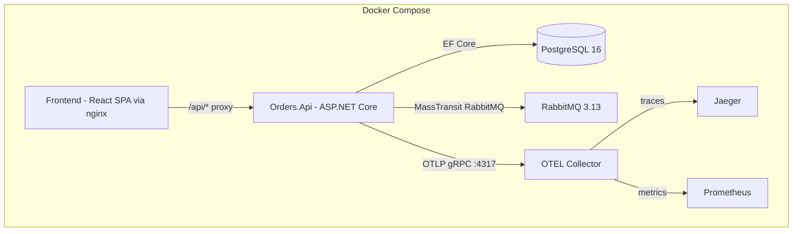
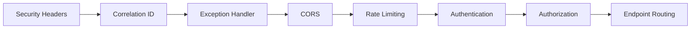

# Design Document: Template Architecture Gaps

## Overview

This design addresses 20 areas of architectural gaps in the EAA .NET 8 Clean Architecture template. The template documents capabilities (MassTransit messaging, Outbox Pattern, observability, resilience, security) in its ADRs but lacks complete implementations. This design provides the technical blueprint to close every gap, making the template production-ready.

The changes span all layers of the system:

- **Orders.Api** — Middleware pipeline additions (correlation IDs, security headers, CORS, rate limiting), health check endpoints, OpenAPI/Swagger, OpenTelemetry metrics, MassTransit RabbitMQ configuration, EF Core migration auto-apply, database seeding.
- **Orders.Infrastructure** — Outbox processor hardening (batching, retry counting, dead-lettering), outbox retention background service, EF migrations with design-time factory, MassTransit RabbitMQ transport registration.
- **Orders.Domain** — No changes (zero external dependencies enforced by architecture tests).
- **Orders.Application** — FluentValidation validators for PlaceOrderCommand.
- **Frontend** — Error boundary, ProblemDetails parsing, loading states, environment-based API URL.
- **Docker Compose** — RabbitMQ (already present), OpenTelemetry Collector, Jaeger, Prometheus services, nginx proxy for `/api`.
- **CI** — EF migrations validation step.
- **Test projects** — Architecture tests (NetArchTest), integration test infrastructure (WebApplicationFactory + Testcontainers).

### Design Principles

1. **Configuration-driven** — All thresholds, intervals, and limits read from `IConfiguration` with sensible defaults.
2. **Extension method composition** — Each cross-cutting concern is a single `IServiceCollection` or `WebApplication` extension, keeping `Program.cs` readable.
3. **Fail-fast in Development, resilient in Production** — Auto-migrate and seed in Development; log warnings and continue in Production.
4. **Observability by default** — Correlation IDs, structured logging, and OTEL metrics wired into every request path.

---

## Architecture

### High-Level System Diagram



### Request Pipeline (Middleware Order)



### Layer Dependencies (enforced by Architecture Tests)

```
Orders.Api → Orders.Application → Orders.Domain
Orders.Api → Orders.Infrastructure → Orders.Application → Orders.Domain
```

- Domain has zero NuGet dependencies.
- Application depends only on MediatR, FluentValidation, and logging abstractions.
- Infrastructure depends on EF Core, MassTransit, and Microsoft.Extensions.Http.Resilience.

---

## Components and Interfaces

### 1. MassTransit RabbitMQ Transport (Req 1, 17)

**Component:** `InfrastructureServiceCollectionExtensions.AddMessaging(IServiceCollection, IConfiguration)`

Registers MassTransit with conditional transport:
- If `RabbitMq:Host` is present → Use `UsingRabbitMq` with retry policy (3 retries, exponential 1s→8s) and error queue (`_error` suffix).
- If `RabbitMq:Host` is absent → Use `UsingInMemory` with warning log.

**Configuration Section:**
```json
{
  "RabbitMq": {
    "Host": "rabbitmq",
    "Username": "guest",
    "Password": "guest",
    "RetryCount": 3,
    "RetryInitialInterval": "00:00:01",
    "RetryMaxInterval": "00:00:08"
  }
}
```

**Startup Retry:** MassTransit's built-in bus start retry with `StartupTimeout` and exponential backoff (5 attempts, 1s initial doubling).

### 2. Outbox Processor Hardening (Req 2, 18)

**Component:** `OutboxProcessor` (enhanced `BackgroundService`)

Changes from current implementation:
- **Batch size** read from config (default 20, `.Take(batchSize)`).
- **RetryCount** column added to `OutboxMessage` entity.
- On failure: increment `RetryCount`, leave `ProcessedAt = null`.
- When `RetryCount >= maxRetries` (default 5): set `FailedAt` timestamp and `FailureReason` string; exclude from polling via `WHERE ProcessedAt IS NULL AND FailedAt IS NULL`.
- **Metrics**: `Counter<long> outbox.messages.processed`, `Counter<long> outbox.messages.failed`, `Histogram<double> outbox.message.duration_ms`.

**Component:** `OutboxRetentionService` (new `BackgroundService`)

- Runs on configurable interval (default 60 min).
- Deletes processed messages older than retention period (default 7 days).
- Deletes in batches of configurable size (default 500) to avoid lock contention.
- Logs count of deleted messages at Information level.

**Updated `OutboxMessage` entity:**
```csharp
public class OutboxMessage
{
    public Guid Id { get; set; }
    public string EventType { get; set; } = string.Empty;
    public string Payload { get; set; } = string.Empty;
    public DateTime OccurredAt { get; set; }
    public DateTime? ProcessedAt { get; set; }
    public int RetryCount { get; set; }
    public DateTime? FailedAt { get; set; }
    public string? FailureReason { get; set; }
}
```

### 3. EF Core Migrations Infrastructure (Req 3)

**Component:** `DesignTimeDbContextFactory` — implements `IDesignTimeDbContextFactory<OrdersDbContext>` in Infrastructure project, uses a hardcoded dev connection string for CLI tooling.

**Initial Migration:** Generated via `dotnet ef migrations add InitialCreate` producing:
- `orders` table (Id GUID PK, CustomerId GUID, Status TEXT)
- `order_lines` table (Id GUID PK, OrderId GUID FK, ProductId GUID, Quantity INT, UnitPrice_Amount DECIMAL, UnitPrice_Currency VARCHAR(3))
- `outbox_messages` table (Id GUID PK, EventType TEXT, Payload TEXT, OccurredAt TIMESTAMPTZ, ProcessedAt TIMESTAMPTZ NULL, RetryCount INT DEFAULT 0, FailedAt TIMESTAMPTZ NULL, FailureReason TEXT NULL)
- Index on `outbox_messages.ProcessedAt` (composite covering `FailedAt IS NULL`)

**Startup Behavior:**
- Development: `dbContext.Database.MigrateAsync()` before `app.Run()`.
- Non-Development: `dbContext.Database.GetPendingMigrationsAsync()` → log warning count, continue.

### 4. Database Seeding (Req 4)

**Component:** `DatabaseSeeder` — static class invoked after migration in Development.

- Checks `orders` table has 0 records.
- Creates 4 orders via domain methods: Pending, Placed (Create→Place), Cancelled (Create→Cancel), Shipped (Create→set Status directly via EF shadow property or reflection, since no domain method exists).
- Each order has 1-3 order lines with realistic amounts.

### 5. Health Checks (Req 5)

**Registration:**
```csharp
builder.Services.AddHealthChecks()
    .AddNpgSql(connectionString, timeout: TimeSpan.FromSeconds(5), tags: ["ready"])
    .AddRabbitMQ(rabbitConnectionString, timeout: TimeSpan.FromSeconds(5), tags: ["ready"]);
```

**Endpoints:**
- `GET /health/live` → maps to liveness (always healthy if process running).
- `GET /health/ready` → maps to readiness (filters by "ready" tag, checks PG + RMQ).
- Both return JSON `ResponseWriter` with entries. No auth required (`.AllowAnonymous()`).

### 6. OpenTelemetry Metrics (Req 6)

**Enhancement to existing OTEL registration:**
```csharp
builder.Services.AddOpenTelemetry()
    .WithTracing(tp => tp
        .AddAspNetCoreInstrumentation()
        .AddEntityFrameworkCoreInstrumentation()
        .AddOtlpExporter())
    .WithMetrics(mp => mp
        .AddAspNetCoreInstrumentation()
        .AddMeter("Orders.Mcp")
        .AddOtlpExporter());
```

**Docker Compose additions:**
- `otel-collector` service (image: `otel/opentelemetry-collector-contrib:0.96.0`) with config exporting to Jaeger (traces) and Prometheus (metrics).
- `jaeger` service (image: `jaegertracing/all-in-one:1.54`) on port 16686.
- `prometheus` service (image: `prom/prometheus:v2.50.0`) on port 9090 with scrape config for OTEL Collector.
- `orders-api` depends_on `otel-collector` with `service_healthy` condition.
- OTEL failure is non-fatal: OTLP exporter drops data if collector unreachable.

### 7. Correlation ID Middleware (Req 7)

**Component:** `CorrelationIdMiddleware`

```csharp
public class CorrelationIdMiddleware
{
    public async Task InvokeAsync(HttpContext context)
    {
        var correlationId = ExtractOrGenerate(context.Request.Headers);
        context.Items["CorrelationId"] = correlationId;
        
        using (LogContext.PushProperty("CorrelationId", correlationId))
        {
            context.Response.OnStarting(() => {
                context.Response.Headers["X-Correlation-Id"] = correlationId;
                return Task.CompletedTask;
            });
            await _next(context);
        }
    }
}
```

- Validates header is non-empty valid GUID; else generates new GUID.
- Outbox processor includes `CorrelationId` in MassTransit headers from outbox message context.
- MassTransit consumers extract header and push to Serilog LogContext.

### 8. CORS (Req 8)

**Registration:**
```csharp
builder.Services.AddCors(options =>
{
    options.AddDefaultPolicy(policy =>
    {
        policy.WithOrigins(configuration.GetSection("Cors:AllowedOrigins").Get<string[]>()!)
              .WithMethods("GET", "POST", "PUT", "DELETE", "OPTIONS")
              .WithHeaders("Authorization", "Content-Type", "X-Correlation-Id")
              .AllowCredentials()
              .SetPreflightMaxAge(TimeSpan.FromSeconds(600));
    });
});
```

**Config:**
```json
{ "Cors": { "AllowedOrigins": ["http://localhost:3000"] } }
```

### 9. Rate Limiting (Req 9)

**Component:** ASP.NET Core 8 built-in rate limiting (`Microsoft.AspNetCore.RateLimiting`).

```csharp
builder.Services.AddRateLimiter(options =>
{
    options.AddFixedWindowLimiter("orders-api", opt =>
    {
        opt.PermitLimit = config.GetValue("RateLimit:PermitLimit", 100);
        opt.Window = TimeSpan.FromSeconds(config.GetValue("RateLimit:WindowSeconds", 60));
    });
    options.OnRejected = async (context, ct) => { /* 429 + Retry-After */ };
});
```

- Partition key: authenticated user claim (`sub`) or fallback to `RemoteIpAddress`.
- Response headers: `X-RateLimit-Limit`, `X-RateLimit-Remaining` added via `OnRejected` and custom metadata.
- Applied to `/api/orders` group via `.RequireRateLimiting("orders-api")`.

### 10. OpenAPI / Swagger (Req 10)

**Registration:**
```csharp
builder.Services.AddOpenApi();
```

**Endpoints:**
- `/openapi/v1.json` — no auth, always served.
- `/swagger` — Swagger UI, served only in Development (conditional `app.UseSwaggerUI()`).

### 11. HTTP Client Resilience (Req 11)

Already partially implemented in `HttpServiceCollectionExtensions.AddInventoryHttpClient`. Enhancement:
- Call `AddInventoryHttpClient(builder.Configuration)` in `Program.cs`.
- The `AddStandardResilienceHandler()` already provides retry (3 attempts, exponential), circuit breaker (5 failures, 30s break), and total timeout (30s).
- `InventoryHttpClient` already throws `ServiceUnavailableException` on exhausted retries/timeout.

### 12. Architecture Tests (Req 12)

**Project:** `Orders.Architecture.Tests` (new xUnit project referencing NetArchTest.Rules).

Tests:
1. Domain project has zero `PackageReference` items (parse `.csproj` XML).
2. No type in Domain implements MediatR interfaces.
3. No type in Application references `Microsoft.EntityFrameworkCore` namespace.
4. `I*Repository` interfaces in Domain are only implemented in Infrastructure.
5. Failure messages include fully qualified type names.

### 13. Integration Testing (Req 13)

**Project:** `Orders.Integration.Tests` (new xUnit project).

- `OrdersWebApplicationFactory` — overrides DI to use Testcontainers PostgreSQL, InMemory MassTransit, and a test auth handler.
- Database reset: drop/recreate between test classes via `Respawn` or re-migration.
- At least one end-to-end test: POST `/api/orders` → verify 201 + DB row.
- MassTransit `InMemoryTestHarness` for message assertion.

### 14. Frontend Error Handling (Req 14)

**Components:**
- `ErrorBoundary` — class component at app root, renders fallback with `role="alert"`.
- `useApiError` hook — parses Axios error responses into ProblemDetails shape.
- Loading indicator with `aria-busy="true"` on containing element.
- 401 handler: clear Zustand store, redirect to `/login` (enhance existing interceptor).
- Network error detection: `!error.response` branch in Axios interceptor.

### 15. Frontend Environment Config (Req 15)

- `http.ts` uses `import.meta.env.VITE_API_BASE_URL || '/api'` as `baseURL`.
- Frontend `Dockerfile` accepts `ARG VITE_API_BASE_URL` and passes it as `ENV` during build.
- Nginx config adds `location /api/ { proxy_pass http://orders-api:8080/api/; }`.

### 16. CI — EF Migrations Validation (Req 16)

New job in `ci.yml`:
```yaml
ef-migrations-check:
  services:
    postgres:
      image: postgres:16
      env: { POSTGRES_USER: postgres, ... }
      options: --health-cmd pg_isready ...
  steps:
    - dotnet tool install dotnet-ef
    - dotnet ef migrations has-pending-model-changes --project src/Orders.Infrastructure --startup-project src/Orders.Api
    - dotnet ef database update --project src/Orders.Infrastructure --startup-project src/Orders.Api --connection "..."
```

30-second timeout on PG readiness; fail build if either command fails.

### 17. Security Headers (Req 20)

**Component:** `SecurityHeadersMiddleware`

Adds on every response:
- `X-Content-Type-Options: nosniff`
- `X-Frame-Options: DENY`
- Removes `Server` header.
- `Strict-Transport-Security: max-age=31536000; includeSubDomains` only when `context.Request.IsHttps`.

### 18. Input Validation (Req 19)

**Component:** `PlaceOrderCommandValidator : AbstractValidator<PlaceOrderCommand>`

Rules:
- `Lines` must not be empty.
- Each line: `Quantity >= 1`, `UnitPrice > 0`.

**Request body size limit:** `app.Use(async (context, next) => { if (context.Request.ContentLength > 1_048_576) { /* 413 */ } })` or Kestrel `MaxRequestBodySize`.

**Malformed JSON:** Already handled by ASP.NET Core model binding returning 400 with ProblemDetails.

---

## Data Models

### OutboxMessage (enhanced)

| Column | Type | Nullable | Notes |
|--------|------|----------|-------|
| Id | GUID | No | PK |
| EventType | TEXT | No | Assembly-qualified type name |
| Payload | TEXT | No | JSON-serialized event |
| OccurredAt | TIMESTAMPTZ | No | Event timestamp |
| ProcessedAt | TIMESTAMPTZ | Yes | Null until successfully published |
| RetryCount | INT | No | Default 0 |
| FailedAt | TIMESTAMPTZ | Yes | Set when max retries exceeded |
| FailureReason | TEXT | Yes | Error description |

**Indexes:**
- `IX_outbox_messages_ProcessedAt` on (ProcessedAt) WHERE FailedAt IS NULL — optimizes polling query.
- `IX_outbox_messages_Retention` on (ProcessedAt) WHERE ProcessedAt IS NOT NULL — optimizes retention cleanup.

### Configuration Models

```csharp
public class OutboxOptions
{
    public int BatchSize { get; set; } = 20;
    public int MaxRetries { get; set; } = 5;
    public int PollingIntervalSeconds { get; set; } = 5;
}

public class OutboxRetentionOptions
{
    public int IntervalMinutes { get; set; } = 60;
    public int RetentionDays { get; set; } = 7;
    public int BatchSize { get; set; } = 500;
}

public class RateLimitOptions
{
    public int PermitLimit { get; set; } = 100;
    public int WindowSeconds { get; set; } = 60;
}

public class RabbitMqOptions
{
    public string Host { get; set; } = string.Empty;
    public string Username { get; set; } = "guest";
    public string Password { get; set; } = "guest";
    public int ConsumerRetryCount { get; set; } = 3;
    public int StartupRetryAttempts { get; set; } = 5;
}
```

---


## Correctness Properties

*A property is a characteristic or behavior that should hold true across all valid executions of a system — essentially, a formal statement about what the system should do. Properties serve as the bridge between human-readable specifications and machine-verifiable correctness guarantees.*

### Property 1: Outbox Batch Ordering and Size

*For any* set of unprocessed outbox messages with distinct OccurredAt timestamps, the outbox processor SHALL retrieve at most `batchSize` messages and they SHALL be ordered by OccurredAt ascending (earliest first).

**Validates: Requirements 2.1**

### Property 2: Outbox Retry State Machine

*For any* outbox message that fails processing: if its RetryCount is less than the configured maximum, the RetryCount SHALL be incremented by 1 and the message SHALL remain eligible for future processing (ProcessedAt and FailedAt both null). If its RetryCount equals or exceeds the configured maximum, the message SHALL have FailedAt set to a non-null timestamp and SHALL be excluded from subsequent processing.

**Validates: Requirements 2.2, 2.3**

### Property 3: Outbox Retention Cleanup

*For any* set of outbox messages where some have ProcessedAt not null and older than the retention period, the retention service SHALL delete exactly those messages (and no others), processing them in batches of the configured size.

**Validates: Requirements 2.4, 18.1, 18.4**

### Property 4: Correlation ID Round-Trip

*For any* HTTP request: if the `X-Correlation-Id` header contains a valid GUID, the response `X-Correlation-Id` header SHALL contain the same GUID value. If the header is absent, empty, or contains a non-GUID string, the response SHALL contain a newly generated valid GUID that differs from the input.

**Validates: Requirements 7.1, 7.2, 7.3, 7.4**

### Property 5: CORS Rejection for Non-Allowed Origins

*For any* HTTP request whose Origin header value is not present in the configured allowed origins list, the response SHALL NOT contain `Access-Control-Allow-Origin`, `Access-Control-Allow-Methods`, or `Access-Control-Allow-Headers` headers.

**Validates: Requirements 8.2**

### Property 6: Rate Limit Enforcement

*For any* authenticated user (or IP for unauthenticated requests) sending more requests than the configured permit limit within a single fixed window, the (N+1)th request SHALL receive HTTP 429 with a `Retry-After` header containing a positive integer representing seconds remaining in the window.

**Validates: Requirements 9.1, 9.2**

### Property 7: Rate Limit Response Headers

*For any* request to the `/api/orders` endpoint group that is processed within the rate limit, the response SHALL include `X-RateLimit-Limit` equal to the configured permit limit and `X-RateLimit-Remaining` equal to the permit limit minus the number of requests already made in the current window (inclusive).

**Validates: Requirements 9.5**

### Property 8: Input Validation — Order Line Numeric Constraints

*For any* PlaceOrder request containing an order line where Quantity is less than 1 or UnitPrice is less than or equal to zero, the API SHALL return HTTP 400 with a ProblemDetails body whose `errors` dictionary includes an entry keyed by the violated property name.

**Validates: Requirements 19.1, 19.2**

### Property 9: Oversized Payload Rejection

*For any* HTTP request body with Content-Length greater than 1,048,576 bytes, the API SHALL return HTTP 413 without deserializing the body.

**Validates: Requirements 19.4**

### Property 10: Malformed JSON Rejection

*For any* request body that is not valid JSON (random byte sequences, truncated JSON, XML, plain text), the API SHALL return HTTP 400 with a ProblemDetails body indicating a malformed request.

**Validates: Requirements 19.5**

### Property 11: Security Headers Present on All Responses

*For any* HTTP response from the Orders API (regardless of endpoint, status code, or request method), the response SHALL include `X-Content-Type-Options: nosniff` and `X-Frame-Options: DENY`, and SHALL NOT include a `Server` header.

**Validates: Requirements 20.1, 20.4, 20.5**

### Property 12: HSTS Conditional on Transport

*For any* response served over HTTPS, the response SHALL include `Strict-Transport-Security` with `max-age` of at least 31536000 and the `includeSubDomains` directive. *For any* response served over plain HTTP, the response SHALL NOT include a `Strict-Transport-Security` header.

**Validates: Requirements 20.2, 20.3**

### Property 13: ProblemDetails Field Error Display

*For any* API error response containing a ProblemDetails body with an `errors` dictionary of N field keys (N ≥ 1), the frontend error display SHALL render at least the first validation error message for each of the N field keys.

**Validates: Requirements 14.2**

---

## Error Handling

### API Layer

| Scenario | HTTP Status | Response Body |
|----------|-------------|---------------|
| FluentValidation failure | 400 | ProblemDetails with `errors` dictionary |
| Malformed JSON | 400 | ProblemDetails with "Malformed request" detail |
| Domain rule violation | 422 | ProblemDetails with domain exception message |
| Rate limit exceeded | 429 | ProblemDetails + `Retry-After` header |
| Oversized body | 413 | Empty or minimal ProblemDetails |
| Resource not found | 404 | ProblemDetails |
| Downstream unavailable | 503 | ProblemDetails with "Service unavailable" |
| Unhandled exception | 500 | ProblemDetails (no stack trace in production) |

### Outbox Processor

- **Type resolution failure** → Increment retry count, log error with message ID and type name.
- **Deserialization failure** → Increment retry count, log error.
- **Publish failure** → Increment retry count, log error.
- **Max retries reached** → Set `FailedAt` and `FailureReason`, exclude from polling.

### Frontend

- **Network error** (no response) → "Unable to reach the server. Please check your connection."
- **401** → Clear auth store, redirect to `/login`.
- **400 with errors dict** → Per-field validation messages.
- **400/422 with detail** → Display `detail` (or `title` fallback).
- **5xx** → Generic "Something went wrong. Please try again."
- **Unhandled render error** → Error boundary fallback with "Reload" button.

### Health Check Degradation

- OTEL Collector unreachable → API continues, telemetry dropped (fire-and-forget OTLP exporter behavior).
- PostgreSQL unreachable → Readiness returns 503; liveness still 200.
- RabbitMQ unreachable → Readiness returns 503; liveness still 200.

---

## Testing Strategy

### Testing Layers

| Layer | Framework | Scope |
|-------|-----------|-------|
| Architecture Tests | xUnit + NetArchTest.Rules | Dependency rule enforcement |
| Unit Tests | xUnit + FluentAssertions | Domain logic, validators, middleware in isolation |
| Property-Based Tests | xUnit + FsCheck (C#) / fast-check (TS) | Correctness properties for validators, middleware, outbox logic |
| Integration Tests | xUnit + WebApplicationFactory + Testcontainers | Full pipeline (HTTP → DB), health checks, auth bypass |
| Frontend Unit Tests | Vitest + Testing Library | Components, hooks, error handling, error boundary |
| Frontend Property Tests | Vitest + fast-check | ProblemDetails parsing, error display |
| Smoke Tests | CI + docker compose | EF migrations, health endpoints, OpenAPI |

### Property-Based Testing Configuration

**Backend (C# — FsCheck):**
- Library: `FsCheck.Xunit` NuGet package
- Minimum iterations: 100 per property
- Tag format in test attribute: `[Property(DisplayName = "Feature: template-architecture-gaps, Property N: <title>")]`
- Properties 1-3 (Outbox logic): test against in-memory DbContext
- Properties 4 (Correlation ID): test middleware with `DefaultHttpContext`
- Properties 5-7 (CORS, Rate Limiting): test via `WebApplicationFactory` or unit test middleware
- Properties 8-12 (Validation, Security Headers): test via `WebApplicationFactory`

**Frontend (TypeScript — fast-check):**
- Library: `fast-check` npm package
- Minimum iterations: 100 per property
- Tag format: `// Feature: template-architecture-gaps, Property 13: ProblemDetails Field Error Display`
- Property 13: Generate arbitrary ProblemDetails responses with random field keys and error arrays

### Unit Testing Focus

- **FluentValidation rules** — example tests for boundary values (Quantity = 0, 1, -1; UnitPrice = 0, -0.01, 0.01)
- **Correlation ID middleware** — specific scenarios (missing header, valid GUID, empty string, "not-a-guid")
- **Security headers middleware** — verify each header on 200, 400, 500 responses
- **Outbox processor** — batch retrieval, retry increment, dead-letter transition
- **Retention service** — delete only expired, respect batch size
- **Error boundary component** — renders fallback on throw, includes role="alert"
- **API error hook** — parses ProblemDetails correctly, handles missing fields

### Integration Testing Focus

- **End-to-end order placement** — POST /api/orders → 201 + DB row + outbox message
- **Health checks** — /health/live (200), /health/ready (200 with deps, 503 without)
- **MassTransit InMemory** — verify published messages in test harness
- **Rate limiting** — exceed limit → 429 + Retry-After
- **Auth bypass** — all endpoints accessible without real JWT in test

### CI Verification

- Architecture tests run as part of `dotnet test` (fail build on violation)
- EF migration validation job (has-pending-model-changes + database update)
- Frontend `npm test` runs Vitest with fast-check property tests
- Coverage threshold: 80% (already enforced)
