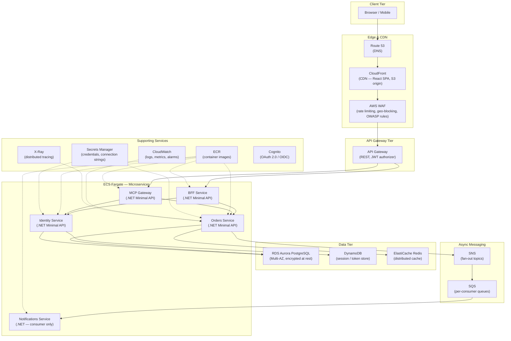

# AWS Cloud Topology

## Overview

This document describes the canonical AWS deployment topology for all services in this platform. Every microservice, the React SPA, and the MCP Gateway are deployed into this architecture. Downstream teams adopt this topology as-is for staging and production environments.

---

## Topology Diagram



---

## ASCII Topology (for non-Mermaid contexts)

```
┌─── AWS Region (us-east-1) ──────────────────────────────────────────────────┐
│                                                                              │
│  Route 53 (DNS)                                                              │
│       │                                                                      │
│       ▼                                                                      │
│  CloudFront (React SPA — S3 origin, HTTPS, cache behaviours)                │
│       │                                                                      │
│  WAF (OWASP managed rules, rate limiting, geo-blocking)                     │
│       │                                                                      │
│       ▼                                                                      │
│  API Gateway (REST, Cognito JWT authorizer, throttling)                     │
│       │                                                                      │
│       ├──────────────────────────────────────────┐                           │
│       ▼                                          ▼                           │
│  ┌─── ECS Fargate Cluster ───────────────────────────────────────┐          │
│  │                                                                │          │
│  │  BFF Service        Identity Service     Orders Service       │          │
│  │  (0.5 vCPU/1 GB)   (0.5 vCPU/1 GB)     (0.5 vCPU/1 GB)     │          │
│  │       │                  │                    │                │          │
│  │       │                  │                    │                │          │
│  │  MCP Gateway        Notifications Service                     │          │
│  │  (0.5 vCPU/1 GB)   (0.25 vCPU/0.5 GB — consumer only)       │          │
│  │                          ▲                                     │          │
│  └──────────────────────────┼─────────────────────────────────────┘          │
│                             │                                                │
│       ┌─────────────────────┼─────────────────────┐                         │
│       │                     │                     │                          │
│       ▼                     ▼                     ▼                          │
│  RDS Aurora PostgreSQL  SNS/SQS              ElastiCache Redis              │
│  (Multi-AZ, r6g.large) (Standard queues)    (cache.t4g.micro)              │
│                                                                              │
│  ── Supporting Services ──────────────────────────────────────────           │
│  ECR (container images)                                                      │
│  Secrets Manager (DB credentials, API keys)                                 │
│  CloudWatch (structured JSON logs, custom metrics, alarms)                  │
│  X-Ray (distributed tracing via OpenTelemetry OTLP export)                  │
│  Cognito (user pools, OAuth 2.0 / OIDC token issuance)                     │
└──────────────────────────────────────────────────────────────────────────────┘
```

---

## Component Descriptions

| Component | Service | Purpose |
|---|---|---|
| Route 53 | DNS | Domain resolution, health-check routing, latency-based routing |
| CloudFront | CDN | Static asset delivery for React SPA, S3 origin, HTTPS termination |
| WAF | Security | OWASP managed rule set, per-IP rate limiting, geo-blocking |
| API Gateway | Gateway | REST API routing, JWT authorizer (Cognito), request throttling |
| ECS Fargate | Compute | Serverless container hosting for all microservices |
| RDS Aurora | Database | Multi-AZ PostgreSQL, encrypted at rest (AES-256), automated backups |
| DynamoDB | NoSQL | Session store, token blacklist, high-throughput key-value lookups |
| ElastiCache Redis | Cache | Distributed caching for order reads, outbox deduplication |
| SNS | Messaging | Fan-out topic for domain events (OrderPlaced, OrderCancelled) |
| SQS | Messaging | Per-consumer queues with dead-letter queue (DLQ) for retry |
| ECR | Registry | Private container image registry, image scanning enabled |
| Secrets Manager | Security | Rotating credentials, injected via ECS task definition |
| CloudWatch | Observability | Centralized logs (JSON), custom metrics, alarm-to-SNS for PagerDuty |
| X-Ray | Observability | Distributed tracing, service map, latency analysis |
| Cognito | Auth | OAuth 2.0 / OIDC provider, user pools, hosted UI |

---

## Network Architecture

- **VPC**: Single VPC per environment with public, private, and isolated subnets across 3 AZs
- **Public subnets**: NAT Gateways, ALB (if used instead of API Gateway)
- **Private subnets**: ECS Fargate tasks, ElastiCache, internal ALBs
- **Isolated subnets**: RDS Aurora (no internet access)
- **Security Groups**: Least-privilege; each service has its own SG allowing only required inbound ports
- **VPC Endpoints**: S3 (gateway), ECR, Secrets Manager, CloudWatch Logs (interface endpoints to avoid NAT charges)

---

## Deployment Model

- All services deploy as ECS Fargate tasks behind an internal ALB or directly routed via API Gateway VPC Link
- Blue/green deployments via ECS deployment controller with automatic rollback on health-check failure
- Container images tagged with git SHA and pushed to ECR during CI
- Task definitions reference Secrets Manager ARNs for environment variable injection

---

## Disaster Recovery

| Tier | RPO | RTO | Strategy |
|---|---|---|---|
| Database (Aurora) | ~1 min | ~5 min | Multi-AZ with automated failover, point-in-time recovery |
| Compute (Fargate) | N/A | ~2 min | Auto-restart on health-check failure, multi-AZ placement |
| Cache (Redis) | N/A | ~1 min | Multi-AZ replication group, automatic failover |
| Static assets (S3) | 0 | 0 | Cross-region replication optional; CloudFront serves from edge |
