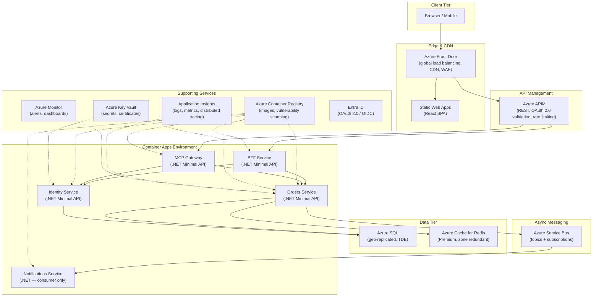

# Azure Cloud Topology

## Overview

This document describes the canonical Azure deployment topology for all services in this platform. It mirrors the AWS topology in capability and maps each component to its Azure equivalent. Downstream teams deploying to Azure adopt this topology as-is.

---

## Topology Diagram



---

## ASCII Topology (for non-Mermaid contexts)

```
┌─── Azure Region (eastus2) ──────────────────────────────────────────────────┐
│                                                                              │
│  Azure Front Door (global LB, CDN, integrated WAF policy)                   │
│       │                                                                      │
│       ├──► Static Web Apps (React SPA — auto-deploy from GitHub)            │
│       │                                                                      │
│       ▼                                                                      │
│  Azure APIM (REST, OAuth 2.0 token validation, rate limiting, caching)      │
│       │                                                                      │
│       ├──────────────────────────────────────────┐                           │
│       ▼                                          ▼                           │
│  ┌─── Container Apps Environment ────────────────────────────────┐          │
│  │                                                                │          │
│  │  BFF Service        Identity Service     Orders Service       │          │
│  │  (0.5 vCPU/1 GB)   (0.5 vCPU/1 GB)     (0.5 vCPU/1 GB)     │          │
│  │       │                  │                    │                │          │
│  │  MCP Gateway        Notifications Service                     │          │
│  │  (0.5 vCPU/1 GB)   (0.25 vCPU/0.5 GB — consumer only)       │          │
│  │                          ▲                                     │          │
│  └──────────────────────────┼─────────────────────────────────────┘          │
│                             │                                                │
│       ┌─────────────────────┼─────────────────────┐                         │
│       │                     │                     │                          │
│       ▼                     ▼                     ▼                          │
│  Azure SQL              Service Bus           Azure Cache for Redis         │
│  (geo-replicated,      (Premium, topics +    (Premium, zone redundant)      │
│   TDE, auto-failover)   subscriptions, DLQ)                                 │
│                                                                              │
│  ── Supporting Services ──────────────────────────────────────────           │
│  ACR (container images, vulnerability scanning, geo-replication)            │
│  Key Vault (secrets, certificates, managed identity access)                 │
│  Application Insights (distributed tracing, live metrics, log analytics)    │
│  Azure Monitor (alerts, dashboards, action groups)                          │
│  Entra ID (OAuth 2.0 / OIDC, managed identities, app registrations)        │
└──────────────────────────────────────────────────────────────────────────────┘
```

---

## Component Mapping (AWS → Azure)

| AWS | Azure | Notes |
|---|---|---|
| Route 53 + CloudFront | Azure Front Door | Combined DNS, CDN, global LB, and WAF |
| S3 (static hosting) | Static Web Apps | Auto-deploy from GitHub, custom domains |
| API Gateway | Azure APIM | API management, policies, developer portal |
| ECS Fargate | Container Apps | Serverless containers, KEDA scaling |
| RDS Aurora PostgreSQL | Azure SQL | Geo-replicated, TDE, auto-failover groups |
| DynamoDB | Cosmos DB (if needed) | Multi-model, global distribution |
| ElastiCache Redis | Azure Cache for Redis | Premium tier for zone redundancy |
| SNS/SQS | Service Bus | Topics + subscriptions, sessions, DLQ |
| ECR | ACR | Geo-replicated, vulnerability scanning |
| Secrets Manager | Key Vault | Secrets, certificates, keys |
| CloudWatch + X-Ray | Application Insights + Monitor | End-to-end observability |
| Cognito | Entra ID | OAuth 2.0 / OIDC, managed identities |
| WAF (AWS WAF) | Front Door WAF Policy | OWASP rule sets, rate limiting |

---

## Authentication and Identity

### OIDC Federation for GitHub Actions (AWS)

All GitHub Actions workflows MUST authenticate to AWS using OIDC federation. This eliminates long-lived credentials.

**Requirements:**

1. Use `aws-actions/configure-aws-credentials` with `role-to-assume` — never `AWS_ACCESS_KEY_ID` / `AWS_SECRET_ACCESS_KEY`
2. The IAM trust policy MUST be scoped to specific repository references:

```json
{
  "Version": "2012-10-17",
  "Statement": [
    {
      "Effect": "Allow",
      "Principal": {
        "Federated": "arn:aws:iam::123456789012:oidc-provider/token.actions.githubusercontent.com"
      },
      "Action": "sts:AssumeRoleWithWebIdentity",
      "Condition": {
        "StringEquals": {
          "token.actions.githubusercontent.com:aud": "sts.amazonaws.com"
        },
        "StringLike": {
          "token.actions.githubusercontent.com:sub": "repo:enterprise-org/orders-service:*"
        }
      }
    }
  ]
}
```

3. **PROHIBITED**: Storing `AWS_ACCESS_KEY_ID` or `AWS_SECRET_ACCESS_KEY` as GitHub secrets. This applies to all environments (staging and production).

4. The trust policy MUST NOT use a wildcard organization-level scope (e.g., `repo:enterprise-org/*`). Each repository must be explicitly listed or scoped to a specific branch pattern.

### OIDC Federation for GitHub Actions (Azure)

For Azure deployments, use federated credentials with Entra ID app registrations:

1. Create an Entra ID app registration with federated credential for the GitHub repository
2. Use `azure/login` action with `client-id`, `tenant-id`, and `subscription-id`
3. **PROHIBITED**: Storing client secrets as GitHub secrets; use federated identity only

---

## GitHub Environments Configuration

### Staging Environment

| Setting | Value |
|---|---|
| Name | `staging` |
| Deployment trigger | Auto-deploy on merge to `main` |
| Approval gate | None |
| Branch policy | `main` only |
| Required secrets | See table below |

### Production Environment

| Setting | Value |
|---|---|
| Name | `production` |
| Deployment trigger | Manual dispatch after staging smoke tests pass |
| Approval gate | Manual approval required from `@enterprise-org/platform-team` |
| Branch policy | `main` only |
| Required secrets | See table below |

### Secrets by Environment

| Secret Name | Scope | Description |
|---|---|---|
| `AWS_ECR_REGISTRY` | staging, production | ECR registry URL (e.g., `123456789012.dkr.ecr.us-east-1.amazonaws.com`) |
| `AWS_DEPLOY_ROLE` | staging, production | IAM role ARN for ECS deployment (OIDC assumed) |
| `AZURE_CLIENT_ID` | staging, production | Entra ID app registration client ID |
| `AZURE_TENANT_ID` | staging, production | Entra ID tenant ID |
| `AZURE_SUBSCRIPTION_ID` | staging, production | Azure subscription ID |
| `SONAR_TOKEN` | repository-level | SonarCloud analysis token (not environment-scoped) |

### Critical Rules

- `AWS_ACCESS_KEY_ID` and `AWS_SECRET_ACCESS_KEY` MUST NOT be stored as GitHub secrets in any environment
- All AWS authentication MUST use OIDC with `role-to-assume`
- All Azure authentication MUST use federated credentials with managed identity
- Secrets MUST be scoped to the minimum required environment (never repository-wide if only needed in production)

---

## Network Architecture (Azure)

- **Virtual Network**: Single VNet per environment with subnet delegation for Container Apps
- **Private Endpoints**: Azure SQL, Key Vault, ACR, Service Bus (no public access)
- **NSGs**: Least-privilege; each Container App has its own subnet with restrictive rules
- **Front Door**: Handles TLS termination, WAF, and global routing; backend pools point to Container Apps ingress

---

## Deployment Model

- Container Apps support revision-based traffic splitting for blue/green and canary deployments
- Images tagged with git SHA, pushed to ACR during CI
- Container Apps pull from ACR using managed identity (no registry passwords)
- Key Vault references injected as environment variables via Container Apps secrets configuration
- KEDA scaling rules configured per app (HTTP trigger for APIs, Service Bus trigger for consumers)

---

## Disaster Recovery

| Tier | RPO | RTO | Strategy |
|---|---|---|---|
| Database (Azure SQL) | ~5 sec | ~30 sec | Auto-failover groups, geo-replicated secondary |
| Compute (Container Apps) | N/A | ~2 min | Multi-zone deployment, automatic restart |
| Cache (Redis) | N/A | ~1 min | Zone-redundant Premium tier |
| Static assets (SWA) | 0 | 0 | Globally distributed, no single point of failure |
